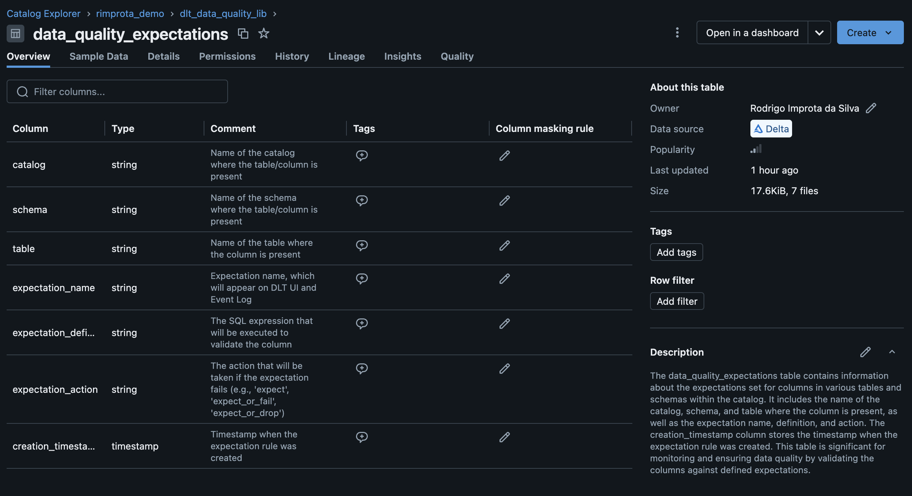
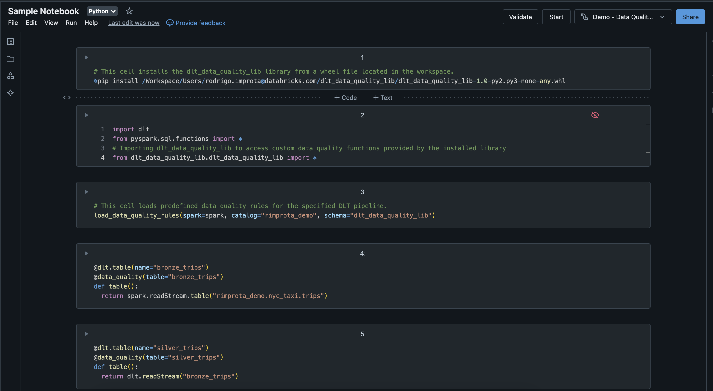

## About the project

This project is a reusable framework for data quality in Delta Live Tables (DLT). Its main objectives are to increase the accuracy and reliability of the data being processed, leveraging the features of DLT expectations in a more scalable and extensible approach.

## Features

### 1. Parameterizable rules
The framework allows rules to be registered and reused easily by all DLT users who wish to improve the data quality of their pipelines. Layout of the rule/expectation registration table:



### 2. Easy use of the framework
To use the framework in your DLT notebook, it's as simple as one function import and call + the addition of the `@data_quality` decorator to the tables that should be monitored. More details on how to use the framework can be found in the [How to use](#how-to-use) section.

### 3. Fail/Drop/Retain Rows
Rules can be configured according to 3 action levels:
- FAIL: If any processed record is caught by this rule, the pipeline execution will fail. Use the rule type 'expect_or_fail'.
- DROP: Records caught by this rule will be *dropped* from the table and written to the quarantine table. Use the rule type 'expect_or_drop'.
- ALLOW: This configuration will only record the number of records caught in this condition. Use the rule type 'expect'.

### 4. Quarantine tables
Records identified in DROP type rules will be written to quarantine tables. For each processed table, the framework will create a table with the suffix *_quarantine* with the same schema as the original table, adding some metadata columns such as execution timestamp and an identification of the failed expectation.

## Framework Deployment

1. Rule registration

Execute the notebook [Environment Setup](utils/environment_setup.sql) which will create the rule registration table and register some sample pre-defined rules.

2. Library build (wheel file)

All the framework code is inside the [dlt_data_quality_lib/](dlt_data_quality_lib/) directory. To build the wheel file:

```
pip install wheel setuptools

cd <repository-root-directory>

python setup.py bdist_wheel --universal
```

The wheel file (.whl) will be generated under the *dist/* directory

Example:

```
dist/dlt_data_quality_lib-1.0-py2.py3-none-any.whl
```

After this step, we need to copy the .whl file to the Databricks workspace. In the example below, I used a directory under a user, but ideally it should be a public directory where all users interested in the framework have read access.

```
/<path-to-your-directory>/dlt_data_quality_lib-1.0-py2.py3-none-any.whl
```

Another possible approach is to deploy the library in an artifact repository and use the *%pip install* command to install it in the notebook.

## How to use

In [example_notebooks/Sample Notebook](example_notebooks/Sample%20Notebook.py) we have an example notebook of how to use the framework within your DLT pipeline. There are 4 steps that must be done for your code to use the framework and its functionalities.

1 - Install the library in the first cell with *pip install*:

```
%pip install /<path-to-your-directory>/dlt_data_quality_lib-1.0-py2.py3-none-any.whl
```

2 - Import the library in your python code:
```
from dlt_data_quality_lib.dq_lib import *
```

3 - Initialize the Data Quality configuration by calling a function:

```
load_data_quality_rules(spark=spark, catalog="<destination-catalog>", schema="<destination-schema>")
```

These parameters are used to read from the rule registration table, which are the expectations that should be considered for this pipeline. 

The catalog and schema needs to be the same which were configured as the target destination of the DLT pipeline. This information is not available in the runtime, so that's the reason why this parameter is required.

4 - Add the `@data_quality` decorator to the tables that should be monitored. This function understands that your table name is the same as the declared function name, but if the names are different, it is necessary to pass the name of your table as a parameter to this decorator. Example:

```
@dlt.table(name='my_gold_table')
@data_quality(table='my_gold_table')
def create_table():
  ...
```

or:

```
@dlt.table()
@data_quality()
def my_gold_table():
  ...
```



Note: when adding the data quality process to a table that already exists and is processed incrementally (streaming), it is recommended to execute a full refresh so that the result of the dropped records are compatible for the entire history of the table and not for just a portion of the data.

## Repository structure

##### [dlt_data_quality_lib/](dlt_data_quality_lib/)
Library/framework code with functions and definitions of the *@data_quality* decorator

##### [docs/images/](docs/images/)
Example images to illustrate this document

##### [example_notebooks/](example_notebooks/)
Example notebooks for a DLT pipeline using the framework and DLT Event Log queries.

##### [utils/](utils/)
Accessory codes to the framework process, such as for initial rule registration.

##### [setup.py](setup.py)
Setup code for dlt_data_quality_lib library when compiling and generating the wheel file (.whl).

## Contributing

Contributions to improve the library are welcome. Please submit pull requests with any enhancements or bug fixes.
